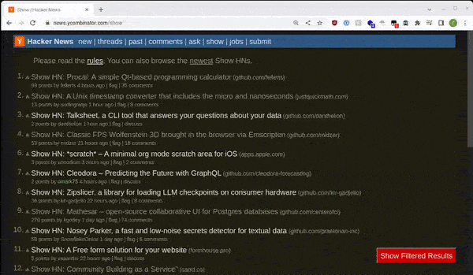
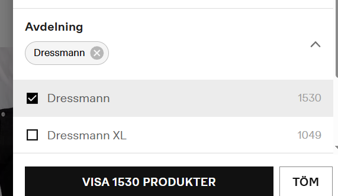

# Userscripts

This repository contains my personal collection of userscripts for Tampermonkey, a browser extension for managing userscripts.

These userscripts are designed to enhance my browsing experience, and might help you too.

## Installation

To use these userscripts, you'll need Tampermonkey installed in your browser. Once you have Tampermonkey installed, you can follow these steps to install a userscript:

1. Go to the `scripts` directory in this repository.
2. Click on the userscript you want to install.
3. Click on the "Raw" button to view the raw source code.
4. Tampermonkey should prompt you to install the script. Click "Install" to complete the installation process.

**NOTE**: Please be aware that these scripts do not have auto-update functionality. If any updates are made to a script, you will need to manually install the new version.

## Userscripts

### Script 1: Hacker News Post Filter

Filter out [Hacker News](https://news.ycombinator.com) posts containing certain words or phrases, has a toggle button in the bottom right.

### Script 2: Dressmann department filter

This is a simple script that automatically applies the "Department" filter on Dressmann's site

It sets it to "Dressmann", if you want "Dressmann XL" you have to change the code to be "Dressmann%20XL"

### Script 3: [Insert Script Name Here]

[Insert Script Description Here]

## License

These userscripts are released under the [GPLv3 License](./LICENSE). You are free to use, copy, distribute and modify the scripts as long as you follow the terms and conditions of the license. If you make any improvements or additions to the scripts, I would appreciate it if you shared your changes.
